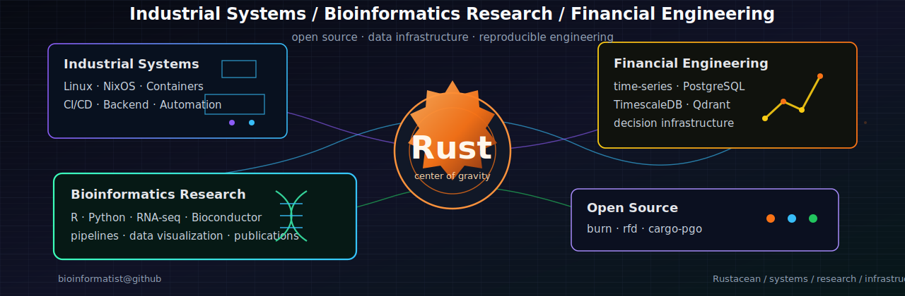

  

Rustacean across industrial systems, bioinformatics research, and financial infrastructure.

## Recent Merged Pull Requests

<!-- RECENT_PRS_START -->
- [amruthpillai/reactive-resume#3095](https://github.com/amruthpillai/reactive-resume/pull/3095) · fix(auth): reconcile migrated social login accounts · merged 2026-05-25
- [luccahuguet/yazelix#596](https://github.com/luccahuguet/yazelix/pull/596) · Fix zellij KGP cargo vendor hash · merged 2026-05-25
- [sctmes/dotfiles#4](https://github.com/sctmes/dotfiles/pull/4) · fix: maint commands · merged 2026-05-07
- [AI4S-YB/pineapplehub#19](https://github.com/AI4S-YB/pineapplehub/pull/19) · feat: mobile · merged 2026-04-26
- [AI4S-YB/pineapplehub#14](https://github.com/AI4S-YB/pineapplehub/pull/14) · feat: implement dynamic theme switching with multiple color palettes · merged 2026-03-30
- [sctmes/graduation-project-ma#9](https://github.com/sctmes/graduation-project-ma/pull/9) · feat: chapter 3 (实验还没做) · merged 2026-03-20

_Last updated: 2026-05-29 08:24 UTC_
<!-- RECENT_PRS_END -->

## Representative Contributions

- [burn](https://github.com/tracel-ai/burn): tensor operators, loss function, and regression support.
- [rfd](https://github.com/PolyMeilex/rfd): WebAssembly support improvements.
- [cargo-pgo](https://github.com/Kobzol/cargo-pgo): Docker image support for easier profile-guided optimization workflows.

## Links

[GitHub](https://github.com/bioinformatist) · [Stack Overflow](https://stackoverflow.com/users/8073702/yu-sun) · [ORCID](https://orcid.org/0000-0003-4269-7187)
